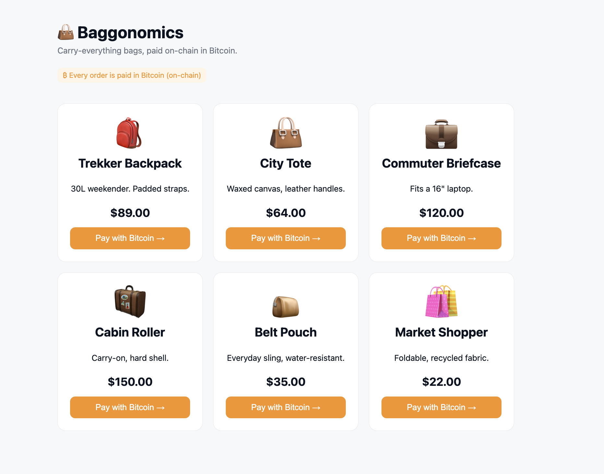
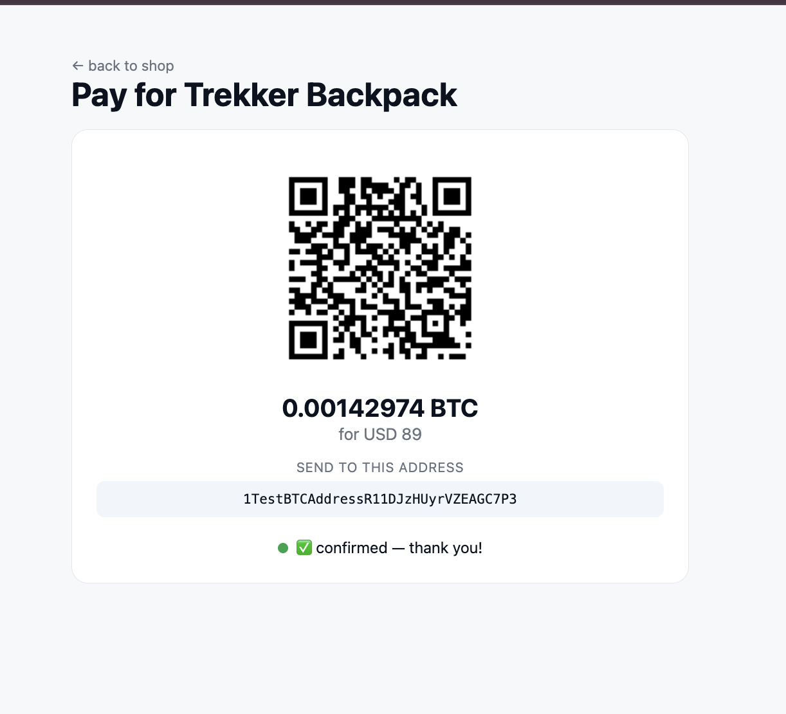

# Baggonomics — a bag store that takes Bitcoin (tested locally with ngrok)



A deliberately tiny online bag store that sells a small catalog of bags and
accepts **Bitcoin** through [Blockonomics](https://developers.blockonomics.co).
It's the companion code to the "test crypto payment APIs locally with ngrok"
tutorial — every snippet in that article is real and runs here.

The catalog lives entirely in `public/index.html`; the backend is
product-agnostic (checkout just takes a product name + a fiat price), so adding
or editing bags is a one-line change in that file.

The whole point is the **callback**. The customer pays on-chain; Blockonomics
sends your server an HTTP request confirming it, and that one request decides
whether the order ships. But Blockonomics lives on the public internet and
`localhost` does not, so the callback never arrives during local development.
[ngrok](https://ngrok.com) opens a public tunnel to your dev server and closes
that gap — no deploy, no real BTC spent.

## How the BTC flow works ?

  


1. **A fresh address per order.** `POST /new_address` with `crypto=BTC` returns a
   brand-new address each time, so the address IS the order key — the webhook
   looks the order up by `addr`. No jittered amounts, no txhash submission.
2. **Blockonomics watches the address for you.** There's no `monitor_tx` step;
   the customer just sends BTC on-chain and the callback fires.
3. **You're notified twice, on purpose.** A WebSocket update to the browser for
   instant "payment seen" UX, and an HTTP callback to your server as the source
   of truth — which fires even if the customer closes the tab.

`status` here is the confirmation phase: `0` unconfirmed (in the mempool), `1`
partial, `2` confirmed. `value` is in **satoshis** (100,000,000 sats = 1 BTC).

## What's here

```
src/
  db.js            one SQLite table, keyed by the per-order address
  blockonomics.js  thin wrappers: btcAddress, btcPrice
  server.js        checkout, the pay-page API, the webhook
public/
  index.html       the shop
  pay.html         the payment page (BIP-21 QR + live WebSocket status)
  styles.css
```

## The flow

```
checkout → lock the price, generate a fresh address, save a pending order
pay      → customer sends BTC on-chain to that address (never hits us)
browser  → a WebSocket to Blockonomics gives instant "payment seen" UX
webhook  → the source of truth: 0 unconfirmed · 1 partial · 2 confirmed
```

## Blockonomics endpoints used

All against `https://www.blockonomics.co/api`, Bearer-authenticated.

- [`POST /new_address`](https://developers.blockonomics.co/reference/post_new-address) — `match_callback`, `crypto=BTC` (returns a fresh address per order)
- [`GET /price`](https://developers.blockonomics.co/reference/get_price) — `crypto=BTC`, `currency`; price of **1 BTC**
- [HTTP callback](https://developers.blockonomics.co/reference/callback-notification) — Blockonomics calls your webhook with **GET** and `secret, addr, value, txid, status, rbf`
- [Payment WebSocket](https://developers.blockonomics.co) — `wss://www.blockonomics.co/payment/{address}` for instant browser updates

## Run it locally with ngrok

```bash
npm install
cp .env.example .env      # then fill in the blanks
```

Open the tunnel and the server in two terminals:

```bash
npm run dev               # terminal 1 — listening on :3000
ngrok http 3000           # terminal 2 — prints a public https URL
```

ngrok prints something like:

```
Forwarding  https://a1b2-c3d4.ngrok-free.app -> http://localhost:3000
```

1. Paste that https URL into `PUBLIC_URL` in `.env`, then restart the server.
2. In **Dashboard > Stores**, set the callback URL to that address plus the
   route and secret:
   ```
   https://a1b2-c3d4.ngrok-free.app/webhook/blockonomics?secret=your_secret_key
   ```
3. Open the inspector at **http://localhost:4040** — you'll see every callback
   with full params, and you can replay any request without a new payment.

> On the free ngrok tier the subdomain changes on every restart, so update both
> `PUBLIC_URL` and the dashboard each time. A paid plan gives you a static domain.

## Test the whole loop (no real BTC)

Use the Blockonomics testmode walkthrough to simulate payments.

1. Check out on the shop. Confirm you get an address and a `pending` order.
2. Trigger a testmode payment to that address.
3. Watch `localhost:4040` for a `status=0` callback. The order flips to `paid`.
4. Trigger confirmation. A `status=2` callback arrives. Order goes to `completed`.

If a callback shows in the inspector but your order doesn't update, the bug is in
your handler. If nothing shows at all, it's upstream: wrong URL, wrong store, or a
`match_callback` that doesn't overlap.

## The three gotchas that bite

- **Make the handler idempotent.** It's hit once per status change, plus retries
  on any non-200. This handler never walks an order back from `completed`.
- **Wait for confirmations on anything instant.** `status=0` means the tx is in
  the mempool, not settled — the sender can still replace it via RBF and cancel.
  For **digital goods**, wait for `status=2` before handing anything over.
  Physical goods are lower risk: they ship later, by which point it's confirmed.
- **Return 200, always.** Anything else and Blockonomics retries up to 7× with
  exponential backoff. Even unknown addresses are acked here so retries stop.

## Going to production

ngrok was scaffolding. The same callback handler you debugged locally is the one
that runs in production. Before you swap the tunnel for your real domain: keep
orders in a real database (this uses one SQLite file), verify **both** the secret
and the payment `value` against what you expected, and set
`https://api.yoursite.com/webhook/blockonomics?secret=...` in the dashboard.

## Heads up — this is a demo

One SQLite file, no migrations. Good enough to learn from; for production you'd
add real migrations, amount verification against `value`, and confirmation
thresholds tuned to what you're selling.
